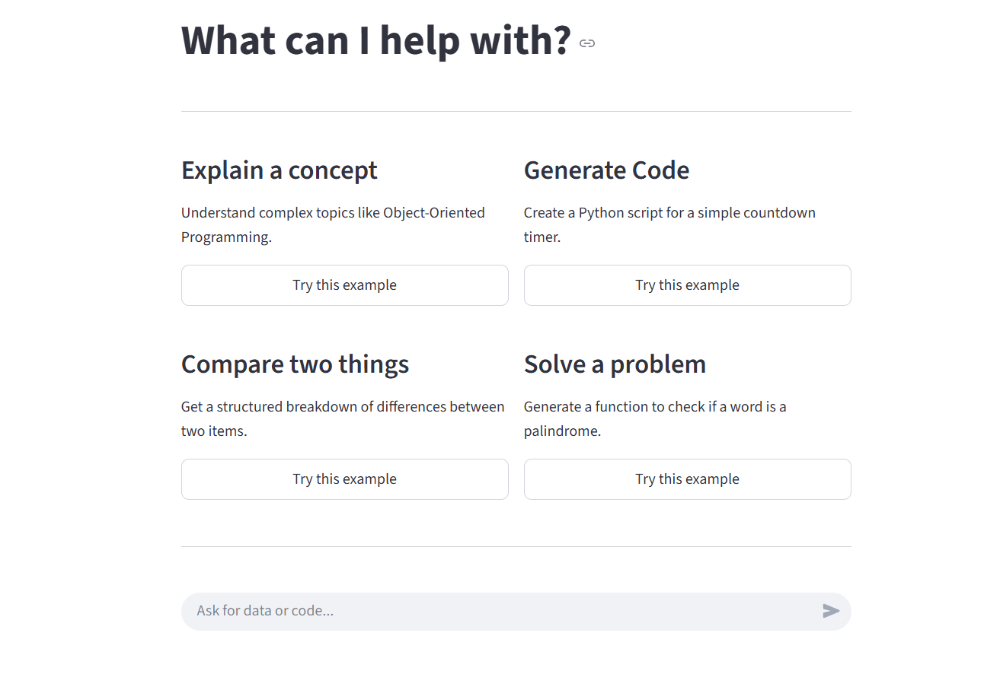
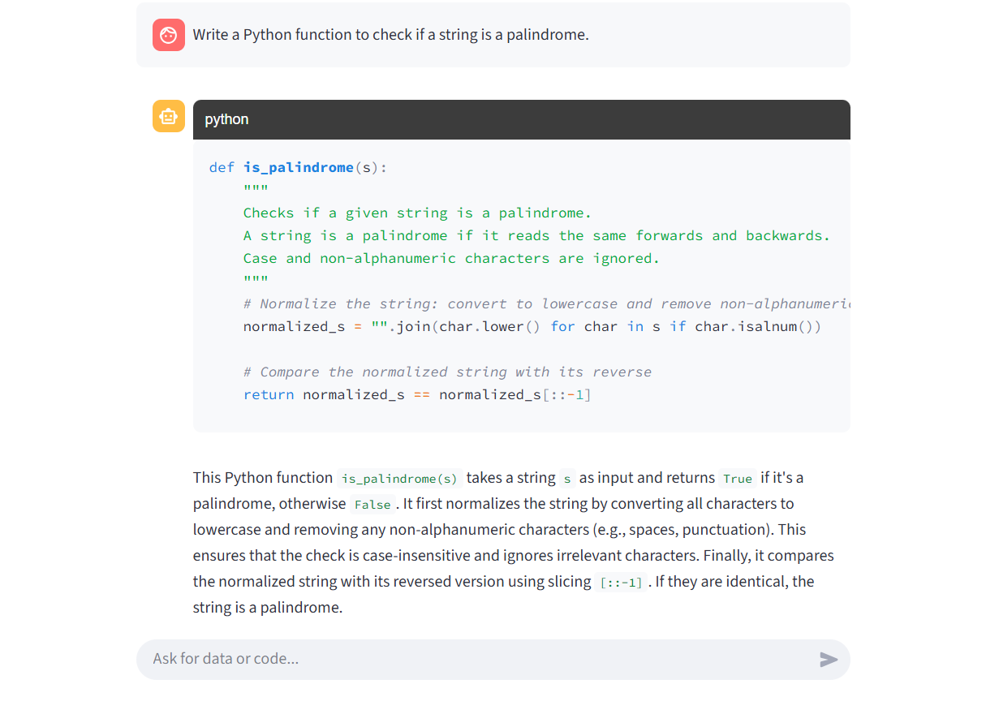

<h1 align="center">🤖 Dynamic Conversational Agent with Streamlit & Gemini</h1>

<p align="center">
  
</p>

<p align="center">
  <b>A context-aware conversational AI built using Python, Streamlit, and Google’s Gemini API.</b><br>
  Delivers intelligent dialogue, dynamic code generation, and a seamless user experience.
</p>

---

## ✨ Overview

This repository hosts a **dynamic conversational agent** that leverages the power of **Google’s Gemini API** to deliver human-like, context-aware conversations.  
Built with **Streamlit** for an elegant UI and **Python asyncio** for performance, the agent seamlessly handles both **information queries** and **code generation requests**, complete with detailed explanations.

---

## 🔑 Key Features

- 🧠 **Intelligent Intent Detection**  
  Automatically distinguishes between informational queries and code generation requests.

- 💬 **Context-Aware Conversations**  
  Remembers previous exchanges, enabling natural follow-up questions (e.g., “Explain the code you just gave me”).

- 💻 **Code Generation with Explanations**  
  Produces executable, well-formatted code blocks along with step-by-step explanations.

- 📊 **Structured Data Output**  
  Returns neatly formatted JSON responses for factual queries.

- ⚡ **High-Performance Async Backend**  
  Uses Python’s `asyncio` for fast, non-blocking processing.

- 🎨 **Modern Streamlit UI**  
  A polished, card-based interface designed for clarity and ease of use.

---

## 🛠️ Tech Stack

| Layer | Technology |
|--------|-------------|
| **Frontend** | Streamlit |
| **Backend & Logic** | Python, asyncio |
| **Language Model** | Google Gemini API *(gemini-2.5-flash-preview-05-20)* |

---

## 🖼️ Sample Output

<p align="center">
  <br><br>
  
</p>

---

## 🚀 Getting Started

Follow these steps to run the application locally.

### 🧩 Prerequisites
- Python **3.8+**
- A valid **Google Gemini API Key**

---

### 🧰 Installation & Setup

#### 1️⃣ Clone the Repository
```bash
git clone https://github.com/YOUR_USERNAME/YOUR_REPOSITORY_NAME.git
cd YOUR_REPOSITORY_NAME
